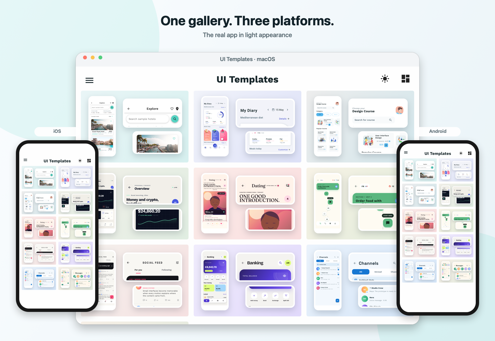
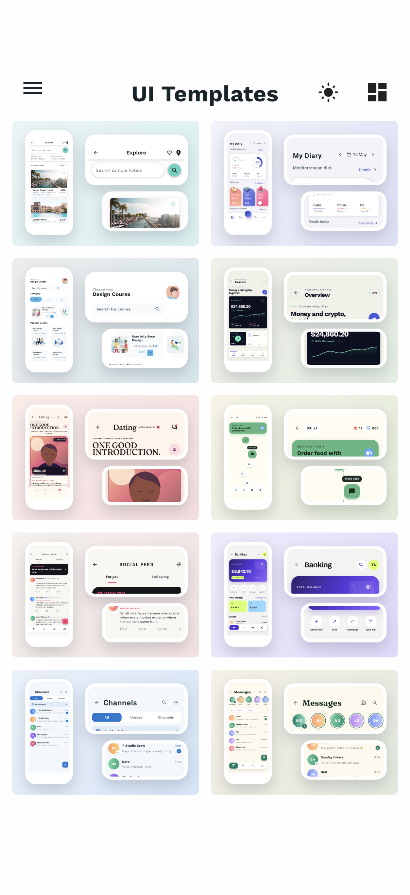
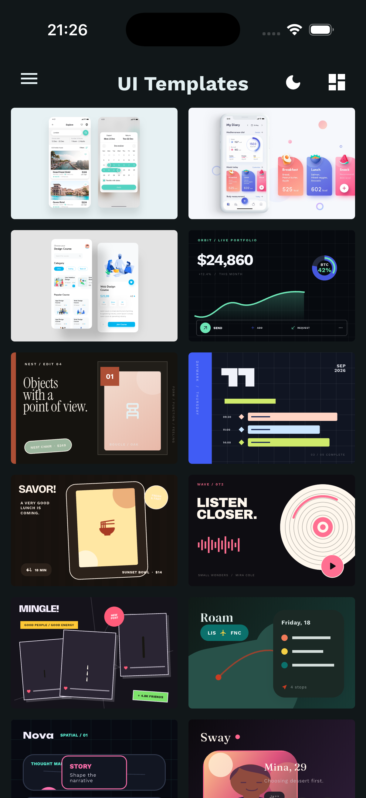

# UI Templates

A free, open-source gallery of Flutter interface examples.

<picture>
  <source media="(prefers-color-scheme: dark)" srcset="screenshots/readme-hero-dark.png">
  <source media="(prefers-color-scheme: light)" srcset="screenshots/readme-hero-light.png">
  
</picture>

The public app has no private backend or telemetry integration; feedback opens a simple support-email draft.

## Run

```sh
fvm flutter pub get
fvm flutter run
```

## Gallery

Ten reusable examples with system, light, and dark appearances.

| Light | Dark |
| :---: | :---: |
|  |  |

## License and attribution

Based on [Best Flutter UI Templates](https://github.com/mitesh77/Best-Flutter-UI-Templates). See [`LICENSE`](LICENSE) and [`THIRD_PARTY_NOTICES.md`](THIRD_PARTY_NOTICES.md).
